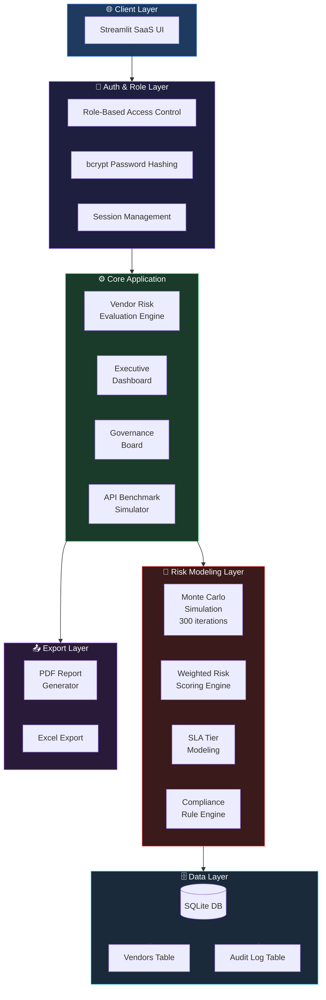
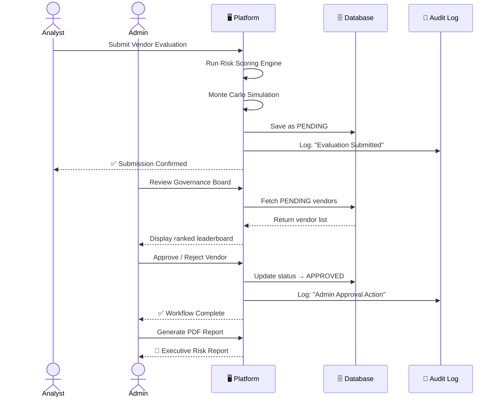
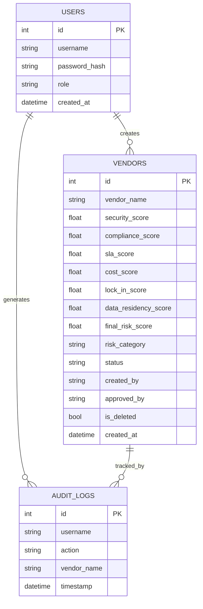

<div align="center">


<br/>

<p>
  
  
  
  
  
</p>

<p>
  <a href="https://enterprise-ai-governance-risk.streamlit.app/">
    
  </a>
</p>

<br/>

> **A production-grade AI governance platform** that helps enterprises evaluate, select, deploy, and monitor AI technologies responsibly — with full audit trails, role-based workflows, and executive reporting.

<br/>

</div>

---

## 📋 Table of Contents

- [🎯 Overview](#-overview)
- [✨ Key Features](#-key-features)
- [🏗️ System Architecture](#-system-architecture)
- [📁 Project Structure](#-project-structure)
- [🔄 Workflow](#-workflow)
- [🛡️ Risk Scoring Model](#-risk-scoring-model)
- [🗄️ Database Schema](#-database-schema)
- [🚀 Getting Started](#-getting-started)
- [🐳 Docker Deployment](#-docker-deployment)
- [☁️ Cloud Deployment](#-cloud-deployment)
- [👤 Demo Credentials](#-demo-credentials)
- [📸 Screenshots](#-screenshots)
- [🗺️ Roadmap](#-roadmap)
- [👩‍💻 Author](#-author)

---

## 🎯 Overview

Enterprises adopting AI must navigate a complex landscape of competing priorities:

<table>
<tr>
<td align="center">🔒<br/><b>Security Risk</b></td>
<td align="center">📋<br/><b>Compliance</b></td>
<td align="center">🌍<br/><b>Data Residency</b></td>
<td align="center">🔗<br/><b>Vendor Lock-in</b></td>
<td align="center">💰<br/><b>Cost Efficiency</b></td>
<td align="center">⚡<br/><b>SLA Reliability</b></td>
</tr>
</table>

This platform provides a **structured, auditable, role-based governance framework** to support enterprise AI decision-making — simulating real-world internal deployment workflows across IT, Security, Procurement, and Engineering teams.

---

## ✨ Key Features

<details>
<summary><b>⚙️ Vendor Risk Evaluation Engine</b></summary>

- Multi-dimensional risk scoring across 6 axes
- Security, compliance, cost, SLA, and lock-in modeling
- **Monte Carlo cost simulation** (300 iterations)
- Automated risk categorization: `Low` / `Moderate` / `High`
- Radar visualization of full risk profile
- One-click executive PDF report generation

</details>

<details>
<summary><b>📊 Executive AI Dashboard</b></summary>

- Total vendors evaluated at a glance
- Average risk score across portfolio
- Safest vendor identification
- Evaluation history trend visualization
- ID-based traceable analytics

</details>

<details>
<summary><b>🏛️ Enterprise Governance Board</b></summary>

- Ranked vendor leaderboard with color-coded risk levels
- Filter by risk category and approval status
- Versioned evaluation history
- Audit-friendly, export-ready view

</details>

<details>
<summary><b>👥 Role-Based Workflow System</b></summary>

| Role | Permissions |
|------|-------------|
| **Admin** | Full access, approve/reject, manage users |
| **Analyst** | Submit evaluations (requires admin approval) |
| **Viewer** | Read-only access to reports and dashboards |

</details>

<details>
<summary><b>📝 Audit Logging</b></summary>

Every governance action is recorded with full traceability:
- ✅ Vendor creation
- ✅ Approval / rejection actions
- ✅ Soft delete & recovery
- ✅ User-action timestamping

</details>

<details>
<summary><b>📤 Export & Reporting</b></summary>

- Executive PDF risk reports
- Excel export of vendor rankings
- Structured deployment summaries

</details>

<details>
<summary><b>🔬 API Benchmark Simulation</b></summary>

Mirrors real AI deployment performance evaluation:
- Latency distribution analysis
- P95 measurement
- Throughput simulation
- SLA tier classification
- System health scoring

</details>

---

## 🏗️ System Architecture



---

## 📁 Project Structure

```
enterprise-ai-governance/
│
├── 📄 app.py                        # Main Streamlit application entrypoint
├── 📄 requirements.txt              # Python dependencies
├── 🐳 Dockerfile                    # Container configuration
├── 📄 .dockerignore
├── 📄 README.md
│
├── 📂 modules/                      # Core application modules
│   ├── 📄 auth.py                   # Authentication & session management
│   ├── 📄 risk_engine.py            # Multi-factor risk scoring logic
│   ├── 📄 monte_carlo.py            # Cost simulation (300 iterations)
│   ├── 📄 compliance.py             # Rule-based compliance scoring
│   ├── 📄 sla_model.py              # SLA tier classification
│   └── 📄 benchmark.py             # API performance simulation
│
├── 📂 database/                     # Data persistence layer
│   ├── 📄 schema.py                 # Table definitions & migrations
│   ├── 📄 vendors.py                # Vendor CRUD operations
│   └── 📄 audit_log.py             # Governance action logging
│
├── 📂 pages/                        # Streamlit multi-page components
│   ├── 📄 1_dashboard.py            # Executive AI Dashboard
│   ├── 📄 2_evaluation.py           # Vendor Risk Evaluation
│   ├── 📄 3_governance.py           # Governance Board
│   ├── 📄 4_workflows.py            # Role-based approval workflows
│   └── 📄 5_benchmarks.py          # API Benchmark Simulation
│
├── 📂 reports/                      # Export & report generation
│   ├── 📄 pdf_generator.py          # Executive PDF reports
│   └── 📄 excel_export.py          # Excel vendor rankings
│
├── 📂 assets/                       # Static assets
│   └── 📄 styles.css               # Custom Streamlit styling
│
└── 📂 tests/                        # Unit & integration tests
    ├── 📄 test_risk_engine.py
    ├── 📄 test_auth.py
    └── 📄 test_database.py
```

---

## 🔄 Workflow



---

## 🛡️ Risk Scoring Model

The platform evaluates vendors across **6 weighted dimensions**:

```
╔══════════════════════════════════════════════════════════╗
║              MULTI-FACTOR RISK SCORE FORMULA             ║
╠══════════════════════════════════════════════════════════╣
║                                                          ║
║  Risk Score =                                            ║
║    (Security Score      × 0.30) +                        ║
║    (Compliance Score    × 0.25) +                        ║
║    (SLA Reliability     × 0.20) +                        ║
║    (Cost Efficiency     × 0.10) +                        ║
║    (Vendor Lock-in Risk × 0.10) +                        ║
║    (Data Residency      × 0.05)                          ║
║                                                          ║
╠══════════════════════════════════════════════════════════╣
║  RISK CATEGORIES                                         ║
║  ● 0.00 – 0.39  →  🟢 Low Risk                          ║
║  ● 0.40 – 0.69  →  🟡 Moderate Risk                     ║
║  ● 0.70 – 1.00  →  🔴 High Risk                         ║
╚══════════════════════════════════════════════════════════╝
```

**Monte Carlo Simulation** runs 300 cost scenarios, sampling variance across:
- License fee uncertainty
- Integration overhead
- Operational cost drift
- Hidden compliance costs

---

## 🗄️ Database Schema



---

## 🚀 Getting Started

### Option 1 — Local Installation

```bash
# 1. Clone the repository
git clone https://github.com/your-username/enterprise-ai-governance.git
cd enterprise-ai-governance

# 2. Create a virtual environment
python -m venv venv
source venv/bin/activate  # Windows: venv\Scripts\activate

# 3. Install dependencies
pip install -r requirements.txt

# 4. Launch the platform
streamlit run app.py
```

Open your browser at `http://localhost:8501`

---

## 🐳 Docker Deployment

```bash
# Build the image
docker build -t ai-governance-platform .

# Run the container
docker run -p 8501:8501 ai-governance-platform

# Access at
http://localhost:8501
```

> 💡 The container dynamically binds to the assigned cloud port for seamless cloud deployment.

---

## ☁️ Cloud Deployment

This platform is cloud-native and deploys to any container-compatible service:

| Platform | Status |
|----------|--------|
| **Render** | ✅ Tested & Verified |
| **Railway** | ✅ Compatible |
| **AWS ECS** | ✅ Compatible |
| **Azure Container Apps** | ✅ Compatible |
| **Google Cloud Run** | ✅ Compatible |

---

## 👤 Demo Credentials

| Role | Username | Password | Access Level |
|------|----------|----------|--------------|
| 🔴 **Admin** | `admin` | `admin123` | Full platform access + approvals |
| 🟡 **Analyst** | `analyst` | `analyst123` | Submit evaluations (pending approval) |
| 🟢 **Viewer** | `viewer` | `viewer123` | Read-only reports & dashboards |

---

## 🗺️ Roadmap

```mermaid
gantt
    title Platform Roadmap
    dateFormat  YYYY-Q
    section Current
    Multi-factor Risk Scoring     :done, 2024-Q3, 1Q
    Monte Carlo Simulation        :done, 2024-Q3, 1Q
    Role-Based Workflows          :done, 2024-Q3, 1Q
    Docker + Cloud Deployment     :done, 2024-Q4, 1Q
    section Near-term
    Real-time API Benchmarking    :active, 2025-Q1, 1Q
    PostgreSQL Migration          :2025-Q1, 1Q
    Immutable Audit Ledger        :2025-Q2, 1Q
    section Future
    Multi-region Compliance Maps  :2025-Q3, 1Q
    Granular RBAC Controls        :2025-Q3, 1Q
    CI/CD Automation              :2025-Q4, 1Q
    Kubernetes Support            :2025-Q4, 1Q
```

---

## 💼 Enterprise Use Cases

| Use Case | Description |
|----------|-------------|
| 🔍 **AI Vendor Procurement** | Objective, multi-dimensional vendor comparison |
| 🏛️ **Internal AI Governance** | Structured deployment decision framework |
| 🔒 **Security Risk Assessment** | Quantified security posture per vendor |
| 🔄 **Cross-Functional Approvals** | IT, Security, Procurement workflow alignment |
| 📋 **Compliance Alignment** | Rule-based regulatory scoring |
| 📊 **Deployment Readiness** | SLA + benchmark-based go/no-go decision support |

---

## 🧑‍💻 Author

<div align="center">


### Debasmita Chatterjee

*Computer Science Undergraduate*

**Applied AI · Governance Systems · AI Deployment Strategy**

<p>
  <a href="https://linkedin.com/in/your-profile">
    
  </a>
  <a href="https://github.com/your-username">
    
  </a>
</p>

</div>

---

<div align="center">


<p><sub>Built with ❤️ to demonstrate production-grade AI governance — not just experimental AI usage.</sub></p>

</div>
