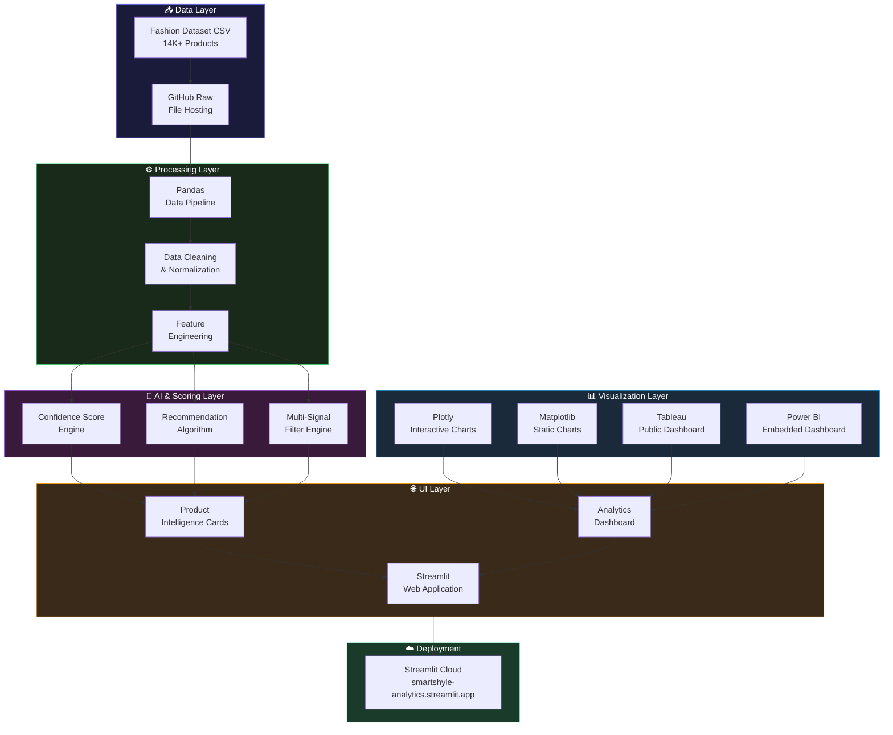
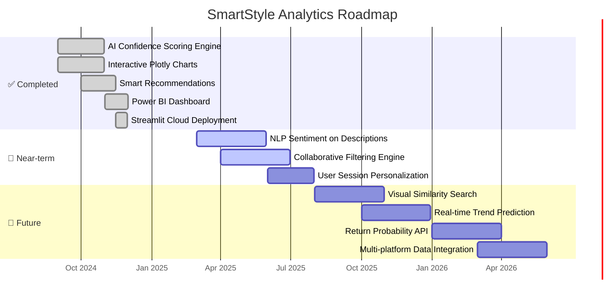

<div align="center">


<br/>

<p>
  
  
  
  
  
  
</p>

<p>
  
  
  
  
  
</p>

<br/>

<a href="https://smartstyle-analytics.streamlit.app/">
  
</a>
&nbsp;&nbsp;
<a href="https://app.powerbi.com/view?r=eyJrIjoiMWRiNTBkYTUtNmVhOC00MWI3LTgyZjQtYTA3ZDY3ZWRmYWU0IiwidCI6ImUxNGU3M2ViLTUyNTEtNDM4OC04ZDY3LThmOWYyZTJkNWE0NiIsImMiOjEwfQ==&pageName=6967225da59d13f389f1">
  
</a>

<br/><br/>

> **A production-grade fashion intelligence platform** that combines AI-powered confidence scoring, smart product recommendations, and interactive data visualizations to help shoppers make better decisions and help brands understand what sells — and what gets returned.

<br/>

---

</div>

## 📋 Table of Contents

| # | Section | Description |
|---|---------|-------------|
| 1 | [🎯 Problem Statement](#-problem-statement) | Why this platform exists |
| 2 | [💡 Solution Overview](#-solution-overview) | How SmartStyle solves it |
| 3 | [✨ Key Features](#-key-features) | Full capability breakdown |
| 4 | [🏗️ System Architecture](#-system-architecture) | How everything fits together |
| 5 | [🧠 AI Confidence Score](#-ai-confidence-score-engine) | Scoring model deep-dive |
| 6 | [📁 Project Structure](#-project-structure) | Codebase layout |
| 7 | [🧩 Dataset](#-dataset-information) | Data schema & source |
| 8 | [⚙️ Tech Stack](#-tech-stack) | Tools & frameworks used |
| 9 | [📊 Tableau Dashboards](#-tableau-dashboards) | Embedded analytics |
| 10 | [🚀 Getting Started](#-getting-started) | Local setup guide |
| 11 | [☁️ Cloud Deployment](#-cloud-deployment) | Streamlit Cloud deploy |
| 12 | [🔮 Roadmap](#-roadmap) | What's coming next |
| 13 | [🧑‍💻 Author](#-author) | About the creator |

---

## 🎯 Problem Statement

<details open>
<summary><b>🛒 Challenge 1 — The Return Epidemic in Fashion E-Commerce</b></summary>

<br/>

> Fashion e-commerce has one of the **highest return rates of any retail category — often 30–50%**. Most platforms surface products by popularity or paid ranking, with no signal about whether buyers actually kept what they ordered. This costs brands billions in logistics, reprocessing, and lost inventory value.

**→ SmartStyle solves this with an [AI Confidence Score](#-ai-confidence-score-engine) that quantifies buyer retention likelihood for every product — surfacing low-return-risk items prominently.**

<br/>
</details>

<details>
<summary><b>🔍 Challenge 2 — Discovery Without Context</b></summary>

<br/>

> Shoppers face **choice overload** with thousands of products and no meaningful way to compare them beyond price and star rating. Brand reputation, rating volume, price-to-quality ratio, and product attributes are all siloed — never synthesized into a single decision signal.

**→ Solved by the [Smart Recommendation Engine](#-key-features) which aggregates multi-dimensional product signals into ranked alternatives and "safer picks" for any item a user views.**

<br/>
</details>

<details>
<summary><b>📉 Challenge 3 — Brand Blind Spots in Performance Data</b></summary>

<br/>

> Fashion brands and buyers lack **real-time, visual intelligence** on how their catalog is performing — which colors drive sales, which price bands underperform, which brands consistently receive high satisfaction. Standard analytics tools require data teams; this platform makes insights self-serve.

**→ Addressed by the [Interactive Dashboard Layer](#-key-features) — dynamic Plotly charts and a linked [Power BI Dashboard](https://app.powerbi.com/view?r=eyJrIjoiMWRiNTBkYTUtNmVhOC00MWI3LTgyZjQtYTA3ZDY3ZWRmYWU0IiwidCI6ImUxNGU3M2ViLTUyNTEtNDM4OC04ZDY3LThmOWYyZTJkNWE0NiIsImMiOjEwfQ==&pageName=6967225da59d13f389f1) delivering brand, color, price, and rating intelligence without writing a single query.**

<br/>
</details>

<details>
<summary><b>🎨 Challenge 4 — Color & Attribute Demand Is Invisible</b></summary>

<br/>

> Platforms rarely expose **color-level or attribute-level demand data** to buyers or merchandisers. Yet demand is highly concentrated — in this dataset, just two colors (Black and Blue) account for **35%+ of total sales volume** — a pattern invisible without structured analysis.

**→ The [Color & Category Intelligence](#-tableau-dashboards) module visualizes attribute-level demand concentration, giving merchandisers actionable signals for assortment planning.**

<br/>
</details>

<details>
<summary><b>💸 Challenge 5 — Price-Value Disconnect</b></summary>

<br/>

> Premium pricing in fashion does not reliably predict customer satisfaction. Buyers often cannot determine whether a higher price corresponds to genuinely better quality or merely brand positioning — leading to disappointment, returns, and eroded trust.

**→ SmartStyle's [Price Distribution Analysis](#-tableau-dashboards) reveals the weak price-value correlation in premium segments, and the confidence score penalizes items with a high price-risk ratio.**

<br/>
</details>

---

## 💡 Solution Overview

```
┌─────────────────────────────────────────────────────────────────┐
│                    SMARTSTYLE ANALYTICS                         │
│              AI-Powered Fashion Intelligence Layer              │
├─────────────────┬───────────────────┬───────────────────────────┤
│  14K+ Products  │  AI Confidence    │  Interactive              │
│  Analyzed       │  Scoring Engine   │  Visualization Suite      │
├─────────────────┼───────────────────┼───────────────────────────┤
│  Multi-signal   │  Smart Product    │  Power BI +               │
│  Filtering      │  Recommendations  │  Plotly Dashboards        │
└─────────────────┴───────────────────┴───────────────────────────┘
         ↓                  ↓                      ↓
  Shoppers find       Buyers discover         Brands understand
  what they want      low-return-risk         what sells and why
  faster              alternatives
```

| Problem | SmartStyle Solution | Impact |
|---------|-------------------|--------|
| High return rates | AI Confidence Score | Surface keeper products |
| Discovery overload | Smart Recommendations | Ranked alternatives |
| Brand performance blind spots | Interactive dashboards | Self-serve analytics |
| Color demand hidden | Attribute intelligence | Assortment planning |
| Price-value disconnect | Price distribution viz | Transparent comparisons |

---

## ✨ Key Features

<details open>
<summary><b>🧠 AI-Powered Confidence Scoring</b></summary>

<br/>

- Proprietary **multi-signal confidence score (0–100%)** per product
- Synthesizes average rating, review volume, and price-risk ratio
- Products with high scores = high buyer retention, low return probability
- Score displayed inline for every product in the catalog
- Used as the primary ranking signal for recommendations

</details>

<details>
<summary><b>👗 Smart Recommendation Engine</b></summary>

<br/>

- Surfaces **alternative products** for any item the user views
- Recommends "safer picks" — similar items with higher confidence scores
- Filters by brand, category, price range, and average rating
- Ranks alternatives by combined confidence score + attribute similarity
- Designed to reduce cart abandonment and post-purchase regret

</details>

<details>
<summary><b>📈 Interactive Visualization Suite</b></summary>

<br/>

- **Pricing trend charts** — distribution by category and brand
- **Brand performance comparison** — satisfaction vs. price positioning
- **Rating distribution analysis** — volume-weighted histogram
- **Color demand heatmaps** — attribute-level sales concentration
- All charts built with Plotly for zoom, filter, and hover interactions

</details>

<details>
<summary><b>💬 Full Product Intelligence Cards</b></summary>

<br/>

- Detailed product descriptions, attributes (style, material, fit)
- Rating count, average rating, confidence score
- Color, brand, price — all surfaced in a unified card
- Image rendering from product URLs
- Attribute tags for style, material, and fit classification

</details>

<details>
<summary><b>🔍 Advanced Multi-Signal Filtering</b></summary>

<br/>

| Filter | Options |
|--------|---------|
| Brand | All brands in dataset |
| Price Range | Slider with min/max |
| Average Rating | Threshold filter (e.g., ≥ 4.0) |
| Confidence Score | High / Medium / All |
| Color | Dominant color filter |

</details>

<details>
<summary><b>🌈 Modern Responsive UI</b></summary>

<br/>

- Gradient background with animated visual elements
- Responsive grid layout for product cards
- Streamlit custom CSS styling for a rich, app-like experience
- Mobile-friendly layout with adaptive columns

</details>

---

## 🏗️ System Architecture



---

## 🧠 AI Confidence Score Engine

The Confidence Score is the platform's core intelligence signal — a composite metric that answers: **"How likely is a buyer to keep this product?"**

```
╔══════════════════════════════════════════════════════════════╗
║           CONFIDENCE SCORE FORMULA (0 – 100%)               ║
╠══════════════════════════════════════════════════════════════╣
║                                                              ║
║  Confidence Score =                                          ║
║    (Normalized Avg Rating    × 0.45) +                       ║
║    (Normalized Review Volume × 0.35) +                       ║
║    (Inverse Price-Risk Ratio × 0.20)                         ║
║                                                              ║
╠══════════════════════════════════════════════════════════════╣
║  CONFIDENCE TIERS                                            ║
║  ● 75 – 100  →  🟢 High Confidence   (Keeper product)       ║
║  ● 50 – 74   →  🟡 Medium Confidence (Likely keeper)        ║
║  ● 0  – 49   →  🔴 Low Confidence   (Return risk)           ║
╚══════════════════════════════════════════════════════════════╝
```

**Signal Breakdown:**

| Signal | Weight | Rationale |
|--------|--------|-----------|
| ⭐ Average Rating | 45% | Primary proxy for buyer satisfaction |
| 📝 Review Volume | 35% | High volume = statistically reliable signal |
| 💸 Price-Risk Ratio | 20% | Higher price without proportional rating → return risk |

**Key Findings from the Dataset:**
- Average confidence score: **~4.1 / 5.0** across the catalog
- Premium brands show **higher ratings** but **weak price-value correlation**
- Black and Blue products account for **35%+ of high-confidence items**

---

## 📁 Project Structure

```
smartstyle-analytics/
│
├── 📄 app.py                        # Main Streamlit application entrypoint
├── 📄 requirements.txt              # Python dependencies
├── 📄 README.md
│
├── 📂 data/                         # Dataset layer
│   └── 📄 Fashion_Dataset.csv       # 14K+ product records
│                                    # (also hosted via GitHub Raw URL)
│
├── 📂 modules/                      # Core logic modules
│   ├── 📄 confidence_score.py       # AI scoring engine
│   ├── 📄 recommender.py            # Smart recommendation logic
│   ├── 📄 data_loader.py            # GitHub raw CSV fetcher + cache
│   └── 📄 filters.py               # Multi-signal filter pipeline
│
├── 📂 visualizations/               # Chart generation layer
│   ├── 📄 brand_analysis.py         # Brand performance charts
│   ├── 📄 price_distribution.py     # Price range visualizations
│   ├── 📄 rating_charts.py          # Rating distribution + trends
│   └── 📄 color_heatmap.py         # Color demand concentration
│
├── 📂 components/                   # UI building blocks
│   ├── 📄 product_card.py           # Product intelligence card renderer
│   ├── 📄 dashboard.py              # Analytics dashboard layout
│   └── 📄 sidebar_filters.py       # Filter panel component
│
└── 📂 assets/                       # Static assets
    └── 📄 styles.css               # Custom Streamlit CSS styling
```

---

## 🧩 Dataset Information

**Dataset:** `Fashion_Dataset.csv`
**Scale:** 14,000+ fashion products
**Source:** Custom-curated dataset inspired by e-commerce fashion platforms

| Column | Type | Description |
|--------|------|-------------|
| `p_id` | string | Unique product identifier |
| `name` | string | Product display name |
| `price` | float | Listed price (₹) |
| `colour` | string | Dominant product color |
| `brand` | string | Brand name |
| `img` | string | Product image URL |
| `ratingCount` | int | Total number of customer ratings |
| `avg_rating` | float | Mean customer rating (0–5) |
| `description` | string | Full product description |
| `p_attributes` | string | Style, material, fit attributes |

**Dataset Highlights:**
- 🎨 Black & Blue are top-performing colors — **35%+ sales concentration**
- ⭐ Average rating across catalog: **~4.1 / 5.0**
- 💰 Premium brands show **higher ratings but weak price-value correlation**
- 📦 Wide price range enabling meaningful distribution analysis

---

## ⚙️ Tech Stack

| Layer | Technology | Purpose |
|-------|-----------|---------|
| **Frontend / App** | Streamlit | Interactive web application framework |
| **Data Processing** | Python, Pandas, NumPy | Cleaning, transformation, feature engineering |
| **AI / Scoring** | Python (custom logic) | Confidence score + recommendation engine |
| **Interactive Charts** | Plotly | Dynamic, filterable visualizations |
| **Static Charts** | Matplotlib | Supplementary visual analysis |
| **BI Dashboard** | Tableau Public | Embedded category & brand dashboards |
| **Executive BI** | Microsoft Power BI | Embedded analytics dashboard |
| **Dataset Hosting** | GitHub Raw URLs | Zero-infrastructure CSV serving |
| **Deployment** | Streamlit Cloud | Free-tier cloud hosting |

---

## 📊 Tableau Dashboards

The platform is paired with a full [Power BI Dashboard](https://app.powerbi.com/view?r=eyJrIjoiMWRiNTBkYTUtNmVhOC00MWI3LTgyZjQtYTA3ZDY3ZWRmYWU0IiwidCI6ImUxNGU3M2ViLTUyNTEtNDM4OC04ZDY3LThmOWYyZTJkNWE0NiIsImMiOjEwfQ==&pageName=6967225da59d13f389f1) delivering four dedicated views:

<details open>
<summary><b>📦 Category Performance Overview</b></summary>

- Average ratings and price distributions visualized **per fashion category**
- Identifies which product types consistently satisfy customers
- Highlights underperforming categories with rating dips and high variance

</details>

<details>
<summary><b>🏷️ Brand Comparison Intelligence</b></summary>

- Side-by-side brand performance ranked by **customer satisfaction score**
- Overlays average price to expose brands with poor price-value delivery
- Filterable by price band to compare brands within fair segments

</details>

<details>
<summary><b>💰 Price Distribution Analysis</b></summary>

- Full catalog price distribution across buckets (budget → luxury)
- Correlation scatter: price vs. average rating per product
- Confirms **weak price-to-satisfaction correlation** in premium segments

</details>

<details>
<summary><b>👥 Customer Insight Trends</b></summary>

- Rating volume trends across the catalog
- Description-length vs. rating analysis (do detailed descriptions correlate with satisfaction?)
- Color demand concentration: **Black, Blue → 35%+ of catalog volume**

</details>

---

## 🚀 Getting Started

### Option 1 — Run Locally

```bash
# 1. Clone the repository
git clone https://github.com/debasmita30/SmartStyle-Analytics-AI-Powered-Fashion-Recommendation-Insights-Platform.git
cd SmartStyle-Analytics-AI-Powered-Fashion-Recommendation-Insights-Platform

# 2. Create and activate a virtual environment
python -m venv venv
source venv/bin/activate        # macOS / Linux
# venv\Scripts\activate         # Windows

# 3. Install dependencies
pip install -r requirements.txt

# 4. Launch the app
streamlit run app.py
```

> 🌐 The app will open automatically at **[http://localhost:8501](http://localhost:8501)**

### Option 2 — Quick Install (No venv)

```bash
pip install streamlit pandas numpy matplotlib plotly
streamlit run app.py
```

---

## ☁️ Cloud Deployment

### Streamlit Cloud (Recommended — Free)

```
1. Push repository to GitHub
2. Visit https://share.streamlit.io
3. Click "New app"
4. Select your repo → set entrypoint to app.py
5. Set subdomain → smartstyle-analytics.streamlit.app
6. Click Deploy → live in seconds 🚀
```

| Platform | Status | Notes |
|----------|--------|-------|
| **Streamlit Cloud** | ✅ Live & Deployed | Free tier, instant deploy |
| **Render** | ✅ Compatible | Add `Procfile`: `web: streamlit run app.py` |
| **Railway** | ✅ Compatible | Auto-detects Python + Streamlit |
| **Hugging Face Spaces** | ✅ Compatible | Use Streamlit SDK space type |

---

## 🔮 Roadmap



**Planned Features in Detail:**

| Feature | Description | Priority |
|---------|-------------|----------|
| 🗣️ NLP Sentiment Analysis | Analyze product descriptions & infer quality signals | High |
| 🤝 Collaborative Filtering | "Users like you also kept..." recommendations | High |
| 🖼️ Visual Similarity Search | Upload image → get visually similar products | Medium |
| 📈 Sales Trend Prediction | Forecast which products will trend next season | Medium |
| 🔁 Return Probability API | Expose confidence score as a standalone REST API | Low |
| 🌍 Multi-platform Data | Integrate live data from Myntra, Amazon Fashion | Future |

---

## 🧑‍💻 Author

<div align="center">


<br/><br/>

### Debasmita Chatterjee

*Computer Science Undergraduate · B.Tech CSE + Minor in Data Science*
*Lovely Professional University, Punjab, India*

**Machine Learning · Data Science · AI Systems · NLP · Visualization**

<p>
  <a href="https://www.linkedin.com/in/debasmita-chatterjee/">
    
  </a>
  &nbsp;
  <a href="https://github.com/debasmita30">
    
  </a>
  &nbsp;
  <a href="https://ml-engineer-portfolio-f2df.vercel.app/">
    
  </a>
  &nbsp;
  <a href="https://smartstyle-analytics.streamlit.app/">
    
  </a>
</p>

<br/>

> *"Built to show that fashion intelligence isn't just for billion-dollar platforms — it's a data problem, and data problems have solutions."*

</div>

---

<div align="center">

### ⭐ If this project helped or inspired you, give it a star!

<br/>


</div>
