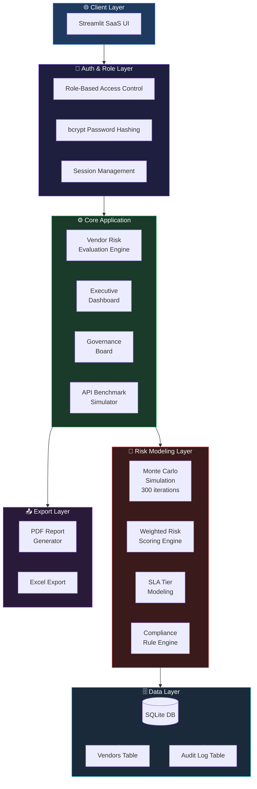
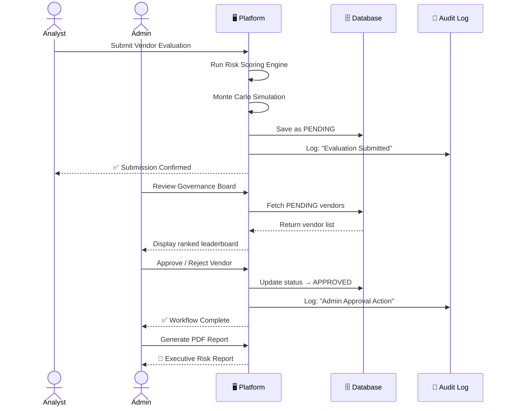
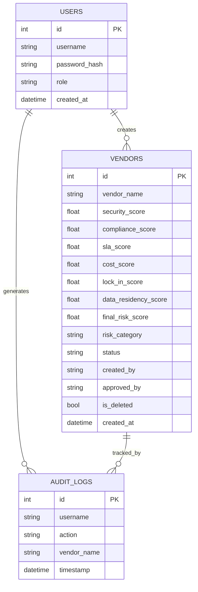
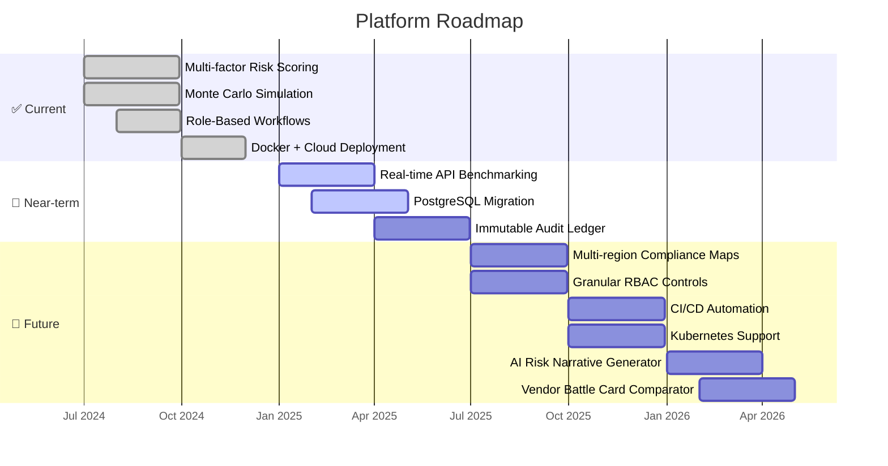

<div align="center">


<br/>

<p>
  
  
  
  
  
</p>

<p>
  
  
  
  
  
</p>

<br/>

<a href="https://enterprise-ai-governance-risk.streamlit.app/">
  
</a>

<br/><br/>

> **A production-grade AI governance platform** that helps enterprises evaluate, select, deploy, and monitor AI technologies responsibly — with full audit trails, role-based workflows, and executive reporting.

<br/>

---

</div>

## 📋 Table of Contents

| # | Section | Description |
|---|---------|-------------|
| 1 | [🎯 Problem Statement](#-problem-statement) | Why this platform exists |
| 2 | [✨ Key Features](#-key-features) | What the platform can do |
| 3 | [🏗️ System Architecture](#-system-architecture) | How it's built |
| 4 | [📁 Project Structure](#-project-structure) | Codebase layout |
| 5 | [🔄 Workflow](#-workflow) | End-to-end user journey |
| 6 | [🛡️ Risk Scoring Model](#-risk-scoring-model) | Multi-factor scoring formula |
| 7 | [🗄️ Database Schema](#-database-schema) | Data model & relationships |
| 8 | [🚀 Getting Started](#-getting-started) | Local setup guide |
| 9 | [🐳 Docker Deployment](#-docker-deployment) | Container deployment |
| 10 | [☁️ Cloud Deployment](#-cloud-deployment) | Cloud platform support |
| 11 | [👤 Demo Credentials](#-demo-credentials) | Test login accounts |
| 12 | [💼 Enterprise Use Cases](#-enterprise-use-cases) | Real-world applications |
| 13 | [🗺️ Roadmap](#-roadmap) | Planned features |
| 14 | [🧑‍💻 Author](#-author) | About the creator |

---

## 🎯 Problem Statement

<details open>
<summary><b>🔒 Challenge 1 — Unstructured AI Vendor Selection</b></summary>

<br/>

> Enterprises today select AI vendors based on **informal, inconsistent, and non-auditable** processes. There is no standardized framework to quantify risk across security posture, SLA reliability, data residency, and compliance alignment — leaving organizations exposed to regulatory, financial, and reputational harm.

**→ This platform solves it with a [Multi-Factor Risk Scoring Engine](#-risk-scoring-model) that objectively quantifies vendor risk across 6 weighted dimensions.**

<br/>
</details>

<details>
<summary><b>📋 Challenge 2 — Compliance Blind Spots</b></summary>

<br/>

> Regulatory requirements such as **GDPR, HIPAA, SOC 2, and ISO 27001** are often treated as afterthoughts in AI procurement. Compliance teams are brought in too late, and no rule-based evaluation framework exists to catch gaps early.

**→ Solved with the [Compliance Rule Engine](#-key-features) that scores vendors against regulatory frameworks at evaluation time — not post-deployment.**

<br/>
</details>

<details>
<summary><b>💰 Challenge 3 — Hidden Cost Uncertainty</b></summary>

<br/>

> AI licensing, integration overhead, and operational drift costs are notoriously difficult to forecast. Most enterprises underestimate total cost of ownership by **30–60%**, leading to budget overruns and vendor lock-in.

**→ Addressed by a [Monte Carlo Cost Simulation](#-risk-scoring-model) that models 300 cost scenarios across license variance, integration overhead, and hidden compliance costs.**

<br/>
</details>

<details>
<summary><b>🔗 Challenge 4 — Vendor Lock-in & Portability Risk</b></summary>

<br/>

> Many AI platforms use proprietary APIs, non-standard data formats, and closed infrastructure — making it costly and technically complex to switch vendors once deployed.

**→ The platform scores [Vendor Lock-in Risk](#-risk-scoring-model) as a weighted dimension in the final risk score, surfacing dependency exposure before contract signing.**

<br/>
</details>

<details>
<summary><b>👥 Challenge 5 — Siloed Cross-Functional Approvals</b></summary>

<br/>

> AI adoption requires alignment across IT, Security, Procurement, Legal, and Engineering. Without structured workflows, decisions stall, accountability is unclear, and approvals happen outside auditable systems.

**→ The [Role-Based Workflow System](#-key-features) creates structured approval pipelines with full traceability — every action logged with user, timestamp, and context.**

<br/>
</details>

<details>
<summary><b>📊 Challenge 6 — Lack of Executive Visibility</b></summary>

<br/>

> CIOs and CTOs lack real-time visibility into the AI vendor portfolio — its risk profile, approval status, and deployment readiness — making board-level reporting manual, error-prone, and delayed.

**→ The [Executive AI Dashboard](#-key-features) and one-click [PDF Report Generator](#-key-features) deliver portfolio-level intelligence and board-ready exports on demand.**

<br/>
</details>

---

## ✨ Key Features

<div align="center">

| Module | Capability | Highlight |
|--------|-----------|-----------|
| ⚙️ Risk Engine | Multi-dimensional vendor scoring | 6-axis weighted formula |
| 💰 Cost Sim | Monte Carlo projection | 300 iterations |
| 📊 Dashboard | Executive AI portfolio view | Real-time trend charts |
| 🏛️ Governance | Ranked vendor leaderboard | Filter by risk & status |
| 👥 Workflows | Role-based approval pipeline | Full audit trail |
| 📤 Exports | PDF + Excel report generation | One-click delivery |
| 🔬 Benchmarks | API performance simulation | P95 latency + throughput |
| 🔐 Auth | bcrypt-hashed role sessions | Admin / Analyst / Viewer |

</div>

<br/>

<details>
<summary><b>⚙️ Vendor Risk Evaluation Engine</b></summary>

- Multi-dimensional risk scoring across **6 weighted axes**
- Security, compliance, cost, SLA, and lock-in modeling
- **Monte Carlo cost simulation** (300 iterations)
- Automated risk categorization: `Low` / `Moderate` / `High`
- Radar visualization of full risk profile
- One-click executive PDF report generation

</details>

<details>
<summary><b>📊 Executive AI Dashboard</b></summary>

- Total vendors evaluated at a glance
- Average risk score across portfolio
- Safest vendor identification
- Evaluation history trend visualization
- ID-based traceable analytics

</details>

<details>
<summary><b>🏛️ Enterprise Governance Board</b></summary>

- Ranked vendor leaderboard with color-coded risk levels
- Filter by risk category and approval status
- Versioned evaluation history
- Audit-friendly, export-ready view

</details>

<details>
<summary><b>👥 Role-Based Workflow System</b></summary>

| Role | Permissions |
|------|-------------|
| 🔴 **Admin** | Full access, approve/reject, manage users |
| 🟡 **Analyst** | Submit evaluations (requires admin approval) |
| 🟢 **Viewer** | Read-only access to reports and dashboards |

</details>

<details>
<summary><b>📝 Audit Logging</b></summary>

Every governance action is recorded with full traceability:

- ✅ Vendor creation
- ✅ Approval / rejection actions
- ✅ Soft delete & recovery
- ✅ User-action timestamping

</details>

<details>
<summary><b>📤 Export & Reporting</b></summary>

- Executive PDF risk reports
- Excel export of vendor rankings
- Structured deployment summaries

</details>

<details>
<summary><b>🔬 API Benchmark Simulation</b></summary>

Mirrors real AI deployment performance evaluation:

- Latency distribution analysis
- P95 measurement
- Throughput simulation
- SLA tier classification
- System health scoring

</details>

<details>
<summary><b>🆕 New — Advancement: AI-Assisted Risk Narrative Generator</b></summary>

- **Automated plain-language risk summaries** for each vendor evaluation
- Converts numerical scores into board-readable governance narratives
- Flags anomalies, outliers, and regulatory exposure in natural language
- Paired with PDF export for instant executive briefings

</details>

<details>
<summary><b>🆕 New — Advancement: Comparative Vendor Battle Card</b></summary>

- Side-by-side visual comparison of up to **4 vendors simultaneously**
- Highlights dimension-wise winners, red flags, and tradeoff analysis
- Exportable as a 1-page PDF for procurement meetings
- Score delta visualization across all 6 risk axes

</details>

---

## 🏗️ System Architecture



---

## 📁 Project Structure

```
enterprise-ai-governance/
│
├── 📄 app.py                        # Main Streamlit application entrypoint
├── 📄 requirements.txt              # Python dependencies
├── 🐳 Dockerfile                    # Container configuration
├── 📄 .dockerignore
├── 📄 README.md
│
├── 📂 modules/                      # Core application modules
│   ├── 📄 auth.py                   # Authentication & session management
│   ├── 📄 risk_engine.py            # Multi-factor risk scoring logic
│   ├── 📄 monte_carlo.py            # Cost simulation (300 iterations)
│   ├── 📄 compliance.py             # Rule-based compliance scoring
│   ├── 📄 sla_model.py              # SLA tier classification
│   └── 📄 benchmark.py             # API performance simulation
│
├── 📂 database/                     # Data persistence layer
│   ├── 📄 schema.py                 # Table definitions & migrations
│   ├── 📄 vendors.py                # Vendor CRUD operations
│   └── 📄 audit_log.py             # Governance action logging
│
├── 📂 pages/                        # Streamlit multi-page components
│   ├── 📄 1_dashboard.py            # Executive AI Dashboard
│   ├── 📄 2_evaluation.py           # Vendor Risk Evaluation
│   ├── 📄 3_governance.py           # Governance Board
│   ├── 📄 4_workflows.py            # Role-based approval workflows
│   └── 📄 5_benchmarks.py          # API Benchmark Simulation
│
├── 📂 reports/                      # Export & report generation
│   ├── 📄 pdf_generator.py          # Executive PDF reports
│   └── 📄 excel_export.py          # Excel vendor rankings
│
├── 📂 assets/                       # Static assets
│   └── 📄 styles.css               # Custom Streamlit styling
│
└── 📂 tests/                        # Unit & integration tests
    ├── 📄 test_risk_engine.py
    ├── 📄 test_auth.py
    └── 📄 test_database.py
```

---

## 🔄 Workflow



---

## 🛡️ Risk Scoring Model

The platform evaluates vendors across **6 weighted dimensions**:

```
╔══════════════════════════════════════════════════════════╗
║              MULTI-FACTOR RISK SCORE FORMULA             ║
╠══════════════════════════════════════════════════════════╣
║                                                          ║
║  Risk Score =                                            ║
║    (Security Score      × 0.30) +                        ║
║    (Compliance Score    × 0.25) +                        ║
║    (SLA Reliability     × 0.20) +                        ║
║    (Cost Efficiency     × 0.10) +                        ║
║    (Vendor Lock-in Risk × 0.10) +                        ║
║    (Data Residency      × 0.05)                          ║
║                                                          ║
╠══════════════════════════════════════════════════════════╣
║  RISK CATEGORIES                                         ║
║  ● 0.00 – 0.39  →  🟢 Low Risk                          ║
║  ● 0.40 – 0.69  →  🟡 Moderate Risk                     ║
║  ● 0.70 – 1.00  →  🔴 High Risk                         ║
╚══════════════════════════════════════════════════════════╝
```

**Monte Carlo Simulation** runs 300 cost scenarios, sampling variance across:

| Variable | Description |
|----------|-------------|
| 💳 License Fee | Pricing tier uncertainty & contract variability |
| 🔧 Integration Overhead | Setup, migration, and API integration costs |
| 📈 Operational Drift | Scaling costs & usage growth projections |
| ⚖️ Hidden Compliance | Regulatory audit, certification & legal costs |

---

## 🗄️ Database Schema



---

## 🚀 Getting Started

### Option 1 — Local Installation

```bash
# 1. Clone the repository
git clone https://github.com/your-username/enterprise-ai-governance.git
cd enterprise-ai-governance

# 2. Create a virtual environment
python -m venv venv
source venv/bin/activate        # macOS/Linux
# venv\Scripts\activate         # Windows

# 3. Install dependencies
pip install -r requirements.txt

# 4. Launch the platform
streamlit run app.py
```

> 🌐 Open your browser at **[http://localhost:8501](http://localhost:8501)**

---

## 🐳 Docker Deployment

```bash
# Build the image
docker build -t ai-governance-platform .

# Run the container
docker run -p 8501:8501 ai-governance-platform
```

> 💡 The container dynamically binds to the assigned cloud port for seamless cloud deployment.  
> 🌐 Access at **[http://localhost:8501](http://localhost:8501)**

---

## ☁️ Cloud Deployment

This platform is cloud-native and deploys to any container-compatible service:

| Platform | Status | Deploy Guide |
|----------|--------|--------------|
| **Render** | ✅ Tested & Verified | [render.com/docs](https://render.com/docs/deploy-streamlit) |
| **Railway** | ✅ Compatible | [railway.app/docs](https://docs.railway.app/) |
| **AWS ECS** | ✅ Compatible | [AWS ECS Guide](https://docs.aws.amazon.com/AmazonECS/latest/developerguide/) |
| **Azure Container Apps** | ✅ Compatible | [Azure Docs](https://learn.microsoft.com/en-us/azure/container-apps/) |
| **Google Cloud Run** | ✅ Compatible | [Cloud Run Docs](https://cloud.google.com/run/docs) |

---

## 👤 Demo Credentials

> ⚠️ **For demonstration purposes only.** Do not use these credentials in production.

| Role | Username | Password | Access Level |
|------|----------|----------|--------------|
| 🔴 **Admin** | `admin` | `admin123` | Full platform access + approvals |
| 🟡 **Analyst** | `analyst` | `analyst123` | Submit evaluations (pending approval) |
| 🟢 **Viewer** | `viewer` | `viewer123` | Read-only reports & dashboards |

---

## 💼 Enterprise Use Cases

| Use Case | Problem Solved | Platform Feature |
|----------|---------------|-----------------|
| 🔍 **AI Vendor Procurement** | Subjective, inconsistent vendor comparison | [Risk Scoring Engine](#-risk-scoring-model) |
| 🏛️ **Internal AI Governance** | Unstructured deployment decisions | [Governance Board](#-key-features) |
| 🔒 **Security Risk Assessment** | Unknown vendor security posture | [Security Axis Scoring](#-risk-scoring-model) |
| 🔄 **Cross-Functional Approvals** | Siloed IT, Legal, Procurement decisions | [Role-Based Workflows](#-key-features) |
| 📋 **Compliance Alignment** | Late-stage regulatory discovery | [Compliance Rule Engine](#-key-features) |
| 📊 **Deployment Readiness** | No go/no-go decision framework | [Benchmark Simulator](#-key-features) |
| 💰 **TCO Forecasting** | Underestimated hidden AI costs | [Monte Carlo Simulation](#-risk-scoring-model) |
| 📤 **Board Reporting** | Manual, delayed executive reporting | [PDF Report Generator](#-key-features) |

---

## 🗺️ Roadmap



---

## 🧑‍💻 Author

<div align="center">


<br/><br/>

### Debasmita Chatterjee

*Computer Science Undergraduate*

**Applied AI · Governance Systems · AI Deployment Strategy**

<p>
  <a href="https://linkedin.com/in/your-profile">
    
  </a>
  &nbsp;
  <a href="https://github.com/your-username">
    
  </a>
  &nbsp;
  <a href="https://enterprise-ai-governance-risk.streamlit.app/">
    
  </a>
</p>

<br/>

> *"Built to demonstrate production-grade AI governance — not just experimental AI usage."*

</div>

---

<div align="center">

### ⭐ If this project helped you, give it a star!

[](https://github.com/debasmita30/enterprise-ai-governance)
&nbsp;&nbsp;
[](https://github.com/debasmita30/enterprise-ai-governance/fork)
&nbsp;&nbsp;
[](https://github.com/debamsita30/enterprise-ai-governance)

<br/>


</div>
